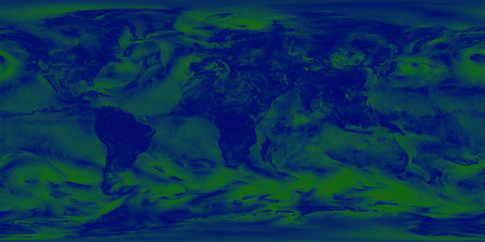

# maritrace-mapbox-weather



## Development

```
npm install
npm run build
```

open http://localhost:8080/docs/

reference visualization: https://earth.nullschool.net/#2020/05/15/0000Z/wind/surface/level/equirectangular

## Download data

```
brew install eccodes
data/gfs/download.sh
```